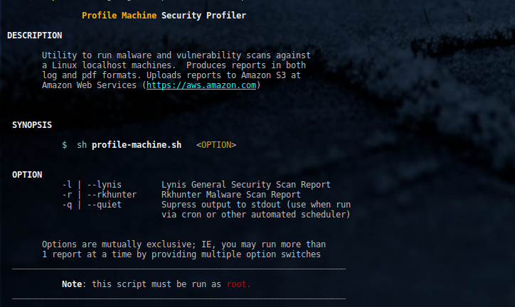

<a name="top"></a>
* * *
# Linux Security & Vulnerability Scanner Utility
* * *
## Summary

[profile-machine](./profile-machine.sh) is a wrapper script utility for installing and running the latest versions of:

* [Rkhunter](https://en.wikipedia.org/wiki/Rkhunter) Malware Scanner
* [Lynis](https://github.com/CISOfy/lynis) Security Scanner

* * *

## Contents

* [Getting Started](#getting-started)
* [Dependencies](#dependencies)
* [IAM](#iam-permissions)
* [Instructions](#instructions)
* [Help](#help)
* [Author & Copyright](#author--copyright)
* [License](#license)
* [Disclaimer](#disclaimer)


* * *

## Getting Started

See the following resources before getting started:

* Rkhunter Official [README](https://sourceforge.net/p/rkhunter/rkh_code/ci/master/tree/files/README)
* Lynis Official [Documentation](https://cisofy.com/documentation/lynis)

[back to the top](#top)

* * *

## Dependencies

* Ubuntu, Ubuntu variants, 14.04
* Ubuntu, Ubuntu variants, 16.04+
* Redhat, Centos v7.0+
* [Amazon Linux](https://aws.amazon.com/amazon-linux-ami) 2017+

[back to the top](#top)

* * *

## IAM Permissions

The propriate Identity and Access Management (IAM) policies required for the Amazon Web Services  
portion of the security report upload and storage are outlined in the [policies](./policies) directory:

* [audit.json](./policies/audit.json): Main IAM policy for upload, storage in [Amazon S3](https://aws.amazon.com/s3)
* [snsPublish.json](./policies/snsPublish.json): Policy to have job notify you via [Amazon SNS](https://aws.amazon.com/sns)

[back to the top](#top)

* * *
## Instructions

**Configuration File**  
1. Enter your host-specific fields into [configuration.json](./config/configuration.json) template

```json
{
    "configuration": {
        "LOG_DIR": "~/logs",
        "CONFIG_DIR": "~/.config/profile-machine",
        "AWS_PROFILE": "default",
        "SNS_TOPIC": "arn:aws:sns:us-east-1:012345678912:mytopic",
        "SNS_REGION": "us-east-1",
        "S3_BUCKET": "securityreports",
        "S3_REGION": "us-east-1",
        "LYNIS_DIR": "~/Security/lynis",
        "REPORTS_ROOT": "~/Documents/Security/reports"
    }
}
```

Place the file in `~/.config/profile-machine/` directory.

2. Install the latest version of [rkhunter malware/ root kit scanner](https://en.wikipedia.org/wiki/Rkhunter) using [this utility](https://github.com/fstab50/gensec/tree/develop/rkhunter).

3. Run the rkhunter malware scanner from the cli via the following command:

```bash
    $ sudo sh profile-machine.sh --rkhunter
```

4. Run the general security profiler,  [Lynis security scanner](https://github.com/CISOfy/lynis) from the cli via the following command:

```bash
    $ sudo sh profile-machine.sh --lynis
```

**NOTE**:
* Root privileges (sudo) must be used or run the installer directly as root
* The installer performs an integrity check using sha256 on all files it
retrieves.  The installation will only proceed if integrity check passes.

[back to the top](#top)

* * *

## Help

To display the help menu:

```bash
    $ sh profile-machine.sh --help
```

[](https://rawgithub.com/fstab50/gensec/master/profile-machine/assets/help-menu.png)


[back to the top](#top)

* * *

## Author & Copyright

All works contained herein copyrighted via below author unless work is explicitly noted by an alternate author.

* Copyright Blake Huber, All Rights Reserved.

[back to the top](#top)

* * *

## License

* Software contained in this repo is licensed under the [license agreement](./LICENSE.md).

[back to the top](#top)

* * *

## Disclaimer

*Code is provided "as is". No liability is assumed by either the code's originating author nor this repo's owner for their use at AWS or any other facility. Furthermore, running function code at AWS may incur monetary charges; in some cases, charges may be substantial. Charges are the sole responsibility of the account holder executing code obtained from this library.*

Additional terms may be found in the complete [license agreement](./LICENSE.md).

[back to the top](#top)

* * *
